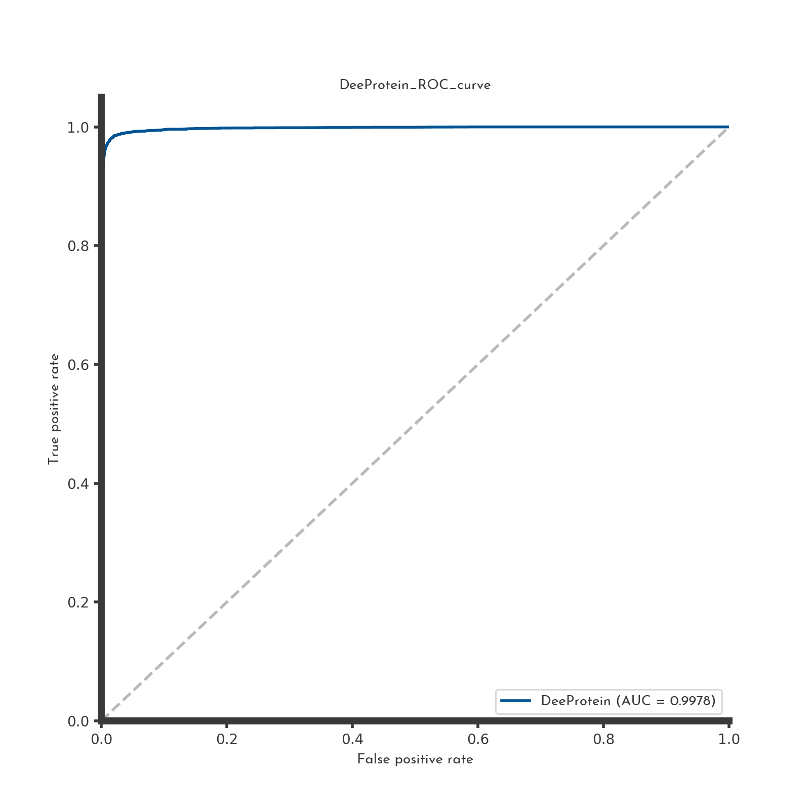
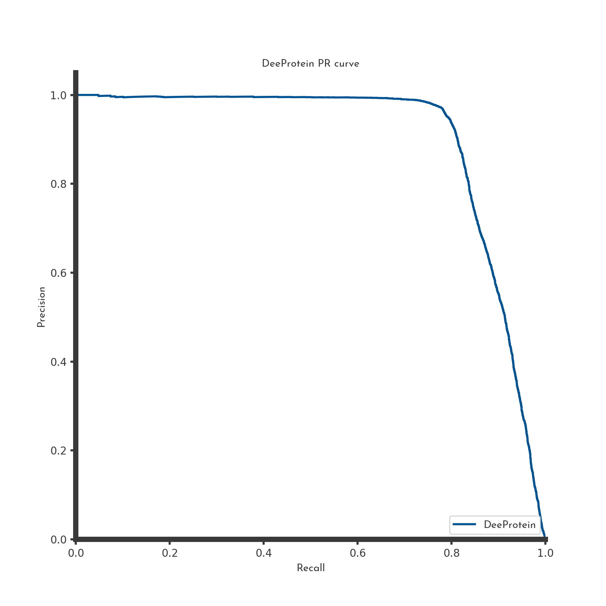

[](https://doi.org/10.5281/zenodo.1035806)

## Prerequisities

- Python 3.5+
- [Tensorflow 1.2+](https://www.tensorflow.org/api_docs/)
- [Tensorlayer 1.5.4+](http://tensorlayer.readthedocs.io/en/latest/)
- [GO-Tools](https://github.com/tanghaibao/goatools)
- [SciPy 0.19](http://www.scipy.org/install.html)
- [Pandas 0.20](https://pandas.pydata.org/pandas-docs/stable/index.html)
- [scikit-learn 0.19](http://scikit-learn.org/stable/install.html#)
- [seaborn 0.8](https://seaborn.pydata.org/index.html)


## Description
DeeProtein is a multilabel classifier to predict protein function from sequence. The model was trained on ~8 million protein sequences on the uniprot database and classifies its input multimodal in 886 classes. DeeProtein is based on the ResNet architecture with 1dimensional kernels and 30 residual blocks. On the validation set of 4500 sequence DeeProtein achieved an AUC under the ROC of 99% and an average F1 score of 78%.
A comprehensive explanation can be found [here](http://2017.igem.org/Team:Heidelberg/Software).


This package contains a Python library with the following funcitonality:

- a comprehensive datapreprocessing pipeline, from the uniprot/swissprot download to the final train and valid datasets.
- a pretrained protein embedding generator, applicable for the embedding of protein sequences.

- a pretrained but extendable deep residual neural network to classify protein sequences for GO-terms:
  The model was trained on uniport database and achieved after 13 epochs an AUC under the ROC of 99%
  and with an average F1 score of 78%.





## Usage

1. Clone this git repository:
   ```bash
   $ git clone https://github.com/igemsoftware2017/AiGEM_TeamHeidelberg2017 && cd AiGEM_TeamHeidelberg2017/DeeProtein
   ```
   
2. To infer a sequence on the pretrained model:
   ```bash
   $ python infer.py --sequence=MSGDRETCSTGLKFJI...
   ```
   
3. For training a custom model download the SwissProt database:
   ```bash
   $ wget ftp://ftp.uniprot.org/pub/databases/uniprot/current_release/knowledgebase/complete/uniprot_sprot.dat.gz
   ```
   And preprocess the data:
   ```bash
   $ python process_data.py --uniprot_path=path_to_download --uniprot_csv=path_to_csv --save_dir=.
   ```
   After preprocessing is done edit the `config_dict` and call:
   ```bash
   $ python train.py --config_json=config_dict.JSON
   ```
   
## Documentation

Please find all [explanation and validatation data](http://2017.igem.org/Team:Heidelberg/Software/DeeProtein) on the iGEM wiki page of the 2017 
Heidelberg team.


```
Help on module helpers:

NAME
    helpers

CLASSES
    builtins.dict(builtins.object)
        StratifiedCounterDict
    builtins.object
        BatchGenerator
        OptionHandler
        RocTracker
        TFrecords_generator
    
    class BatchGenerator(builtins.object)
     |  Batchgenerator of the DeeProtein model.
     |  This Class generates the life batches for inference and holds important information such as the class_dict
     |  and the embedding_dict.
     |  It further can be used to perform tests on a model by generating batches of garbage sequences or batches of
     |  sequences for inference.
     |  
     |  Attributes:
     |      _opts: A `helpers.OptionHandler` holding the global options for the module.
     |      mode: A `str`. Has to be one of ['one_hot_padded']
     |      inferencedata: A `fileObject` the file from which to infer.
     |      traindata: A `fileObject` the file from which to train.
     |      validdata: A `fileObject` the file from which to evaluate.
     |      AA_to_id: A `dict` mapping single letter AAs to integers.
     |      id_to_AA: A `dict` the reverse of AA_to_id.
     |      class_dict: An `OrderedDict` mapping `str` labels to integers. The order is kept from the EC_file specifier in
     |        the config_dict.
     |      id_to_class: An `OrderedDict` the reverse class_dict.
     |      embedding_dict: An `OrderedDict` mapping sequence names to the index in the protein embedding.
     |      garbage_percentage: A `float32` defining the amount of Garbage to incorporate in the dataset.
     |      garbage_count: A `int32` used to count the nr of garbage that has been written.
     |      eval_batch_nr: A `int32`, the nr of batches needed for complete evaluation of the valid set.
     |      batches_per_file: A `int32`, defines the nr of batches that is included in a tf.Records file.
     |      epochs: A `int32` defining the nr of epochs to train.
     |      curr_epoch: A `int32` counter for the epcohs.
     |      label_enc: A `sklearn.preprocessing.OneHotEncoder` used to encode the labels.
     |      AA_enc: A `sklearn.preprocessing.OneHotEncoder` used to encode the AA letters.
     |  
     |  Methods defined here:
     |  
     |  __init__(self, optionhandler)
     |      Initialize self.  See help(type(self)) for accurate signature.
     |  
     |  generate_batch(self, is_train)
     |      Generate a batch for the feed_dict pipeline.
     |      
     |      This function is depracted. Please use the input pipeline along with the TFrecordsgenrator
     |      training sequence input.
     |      
     |      Args:
     |        is_train: A `bool` from which dataset (train/valid) to draw the samples.
     |      
     |      Returns:
     |        batch: A `Tensor`, [batchsize, 20, windowlength, 1] holding the inference data batch.
     |        label_batch: A `Tensor`, [batchsize, n_classes] holding the labels.
     |        positions: A `Tensor` [batchsize, start, end], where the start/end position of a sequence is.
     |  
     |  generate_binary_batch(self)
     |      Generate a binary batch for training protein activity.
     |      
     |      This function requires a special input dataset, where the labels are already encoded as their target float.
     |      Thus this function does NOT use the GO-file nor the examples dumps.
     |      Labels should be encoded from 0 (no activity) over 0.5 (first active bin) to 1. (maximum activity).
     |      
     |      Returns:
     |          batch: A np.ndarray holding the batch
     |          labels: A np.ndarray holding the labels
     |  
     |  generate_garbage_sequence(self, return_name=False)
     |      Generate a garbage sequence.
     |      Generates a sequence full of garbage, e.g. a obviously non functional sequence. Used to test the robustness of
     |      the model precision.
     |      
     |      Args:
     |        return_name: A `bool`, if True return the garbage sequene along wih a generated name.
     |      
     |      Returns:
     |        name: A `str` holding the sample name (if return_name is True).
     |        padded_seq: A `Tensor` holding the one-hot encoded and padded (to windowlength) garbage sequence.
     |        label: A `Tensor` holding the one-hot encoded labels (depending on encode_labels, otherwise raw labels).
     |          The labels of a garbage sequence are a zeros Tensor.
     |        garbage_label: A `Tensor` holding the garbage label (binary, either 1 for garbage or 0 for valid sequence).
     |  
     |  generate_random_data_batch(self)
     |      Generates a batch consisting solely of random data.
     |      
     |      Generate a batch full of random data drawn form a normal distribution.
     |      
     |      Returns:
     |        seq_tensor_batch: A `Tensor`, [batchsize, 20, windowlength, 1] holding the random data batch.
     |        onehot_labelled_batch: A `Tensor`, [batchsize, n_classes] holding the random labels.
     |  
     |  generate_valid_batch(self, include_garbage=False)
     |      Generate a batch of sequences form the valid set for inference.
     |      Draws samples from the valid set and generates a batch to infer the labels. As everything is fed into
     |      the same graph, we use the same kind of preprocessing as in generate_batch().
     |      
     |      This function is also used in the DeeProtein.generate_embedding().
     |      
     |      Args:
     |        include_garbage: A `bool`, if True, include garbage sequences into the valid batch (optional).
     |          Defaults to False
     |      
     |      Returns:
     |        batch: A `Tensor`, [batchsize, 20, windowlength, 1] holding the sequences batch.
     |  
     |  ----------------------------------------------------------------------
     |  Data descriptors defined here:
     |  
     |  __dict__
     |      dictionary for instance variables (if defined)
     |  
     |  __weakref__
     |      list of weak references to the object (if defined)
    
    class OptionHandler(builtins.object)
     |  This Class holds all the Options from the config.JSON. The Attributes of this class are directly accessed
     |  by DeeProtein, the BatchGenerator, the ROCtracker and the TFrecordsgenerator.
     |  
     |  Attributes:
     |    config: A `dict` holding all the global paramters. This is read from config.JSON.
     |    _name: A `str` holding the model name.
     |    _thresholdnum: `int32`, nr of thresholds to use to calculate the ROC/PR metrics.
     |    _gpu: `int32`, which gpu to use in multiGPU context.
     |    _allowsoftplacement: `str` if 'True' the Variables can be moved to CPU.
     |    _numepochs: `int32` the number of epochs to calculate. DEPREACTED. Use numsteps instead.
     |    _numsteps: `int32` the number of steps to run the model.
     |    _embeddingdim: `int32` the dimension of the protein embedding generated by Deeprotein.generate_embedding().
     |    _depth: `int32` the depth the nr of amino acids. Defaults to 20.
     |    _structuredims: `int32` the nr of structural elements to consider in the structure embedding.
     |    _traindata: `str` the path to the traindataset.
     |    _validdata: `str` the path to the validdataset.
     |    _batchesdir: `str` the path to the examples directory.
     |    _inferencemode: `str` if 'True' model is initialized in inference mode.
     |    _labels: `str` the type od labels to use must be one of ['EC' or 'GO']. Until now only 'GO' is fully implemented.
     |    _nclasses: `int32` the number of classes to consider. This number must match the line number in the EC_file.
     |    _classbalancing: `str` if 'True' the classes are weighted for their size/their importance during training.
     |    _maxclassinbalance: `int32` the maximum weight a class can obtain.
     |    _dropoutrate: `float32` the dropout to assign to fully connected layers.
     |    _learningrate: `float32` the learningrate.
     |    _epsilon: `float32` the epsilon parameter of the Adam optimizer.
     |    _batchsize: `int32` the bacthsize to apply in trainig and validation mode.
     |    _batchgenmode: `str` currently only one option is available: 'one_hot_padded'
     |    _windowlength: `int32` the length of the window to apply on a sequence.
     |    _minlength: `int32` the minlength a sequence must have to be included in the dataset.
     |    _numthreads: `int32` the number of threads to use in the inputpipeline.
     |    _restorepath: `int32` the path from which to restore the model.
     |    _restore: `str` if 'True' the model is restored from the path specified in the restorepath.
     |    _debug: `str` if 'True' the model is initialized in the debug mode.
     |    _ec_file: `str` the path to the EC_file, holding all labels and the label sizes.
     |    _summariesdir: `str` the directory where to store the model and to write the summaries.
     |  
     |  Methods defined here:
     |  
     |  __init__(self, config_dict)
     |      Initialize self.  See help(type(self)) for accurate signature.
     |  
     |  write_dict(self)
     |      Store the config_dict on disc in the save_dir.
     |  
     |  ----------------------------------------------------------------------
     |  Data descriptors defined here:
     |  
     |  __dict__
     |      dictionary for instance variables (if defined)
     |  
     |  __weakref__
     |      list of weak references to the object (if defined)
    
    class RocTracker(builtins.object)
     |  This class calculates comprehensive metrics for the validation of the performace of DeeProtein.
     |  The calculated metrics include Area under the ROC-Curve and AUC under the Precision/recall-curve.
     |  
     |  Attributes:
     |  _opts: A `helpers.OptionHandler` defining the global preferences.
     |  metrics_path: `str` the path to the metrics folder.
     |  metrics_file: `str` file to the metrics.csv where the most recent metrics are stored.
     |  roc_score: `Array` holding the logits of the model for each validation batch.
     |  roc_labels: `Array` holding the labels of the model for each validation batch.
     |  pred_positives_sum: `Array` holding the positive predictions for each class.
     |  actual_positives_sum: `Array` holding the condition positives predictions for each class.
     |  true_positives_sum: `Array` holding the true positives predictions for each class.
     |  num_calculations: `int32` as a counter.
     |  
     |  Methods defined here:
     |  
     |  __init__(self, optionhandler)
     |      Initialize self.  See help(type(self)) for accurate signature.
     |  
     |  calc_and_save(self, logfile)
     |      Calculate the ROC curve with AUC value for the collected test values (roc_scores, roc_labels).
     |      Writes everything to files, plots curves and resets the Counters afterwards.
     |      
     |      Args:
     |        logfile: `file-object` the logfile of the DeeProtein model.
     |  
     |  plot_simple_curve(self, x, y, title, legend, xname, yname, filename, include_linear=True, iGEM_style=True)
     |      Plots simple curve in the iGEM style if wanted.
     |      
     |      Args:
     |        x: `Array1d`, what to plot on the x-Axis.
     |        y: `Array1d` what to plot on the y-Axis.
     |        title: `str`, the title.
     |        legend:`str`, the legend.
     |        xname: `str`, the name of the x axis.
     |        yname: `str`, the name of the y axis.
     |        filename: `str`, path to the file where to save the plot.
     |        include_linear: `bool`, whether to plot a linear line with slope=1.
     |        iGEM_style: `bool`, whether to plot in the iGEM-Heidelberg style layout.
     |  
     |  update(self, sigmoid_logits, true_labels)
     |      Update the ROC tracker, with the predictions on one batch made during validation.
     |      
     |      Args:
     |        sigmoid_logits: `np.Array` and 2D arrray holding the sigmoid logits for the validation batch.
     |        true_labels: `np.Array` and 2D arrray holding the true labels for the validation batch.
     |  
     |  ----------------------------------------------------------------------
     |  Data descriptors defined here:
     |  
     |  __dict__
     |      dictionary for instance variables (if defined)
     |  
     |  __weakref__
     |      list of weak references to the object (if defined)
    
    class StratifiedCounterDict(builtins.dict)
     |  dict() -> new empty dictionary
     |  dict(mapping) -> new dictionary initialized from a mapping object's
     |      (key, value) pairs
     |  dict(iterable) -> new dictionary initialized as if via:
     |      d = {}
     |      for k, v in iterable:
     |          d[k] = v
     |  dict(**kwargs) -> new dictionary initialized with the name=value pairs
     |      in the keyword argument list.  For example:  dict(one=1, two=2)
     |  
     |  Method resolution order:
     |      StratifiedCounterDict
     |      builtins.dict
     |      builtins.object
     |  
     |  Methods defined here:
     |  
     |  __missing__(self, key)
     |  
     |  ----------------------------------------------------------------------
     |  Data descriptors defined here:
     |  
     |  __dict__
     |      dictionary for instance variables (if defined)
     |  
     |  __weakref__
     |      list of weak references to the object (if defined)
     |  
     |  ----------------------------------------------------------------------
     |  Methods inherited from builtins.dict:
     |  
     |  __contains__(self, key, /)
     |      True if D has a key k, else False.
     |  
     |  __delitem__(self, key, /)
     |      Delete self[key].
     |  
     |  __eq__(self, value, /)
     |      Return self==value.
     |  
     |  __ge__(self, value, /)
     |      Return self>=value.
     |  
     |  __getattribute__(self, name, /)
     |      Return getattr(self, name).
     |  
     |  __getitem__(...)
     |      x.__getitem__(y) <==> x[y]
     |  
     |  __gt__(self, value, /)
     |      Return self>value.
     |  
     |  __init__(self, /, *args, **kwargs)
     |      Initialize self.  See help(type(self)) for accurate signature.
     |  
     |  __iter__(self, /)
     |      Implement iter(self).
     |  
     |  __le__(self, value, /)
     |      Return self<=value.
     |  
     |  __len__(self, /)
     |      Return len(self).
     |  
     |  __lt__(self, value, /)
     |      Return self<value.
     |  
     |  __ne__(self, value, /)
     |      Return self!=value.
     |  
     |  __new__(*args, **kwargs) from builtins.type
     |      Create and return a new object.  See help(type) for accurate signature.
     |  
     |  __repr__(self, /)
     |      Return repr(self).
     |  
     |  __setitem__(self, key, value, /)
     |      Set self[key] to value.
     |  
     |  __sizeof__(...)
     |      D.__sizeof__() -> size of D in memory, in bytes
     |  
     |  clear(...)
     |      D.clear() -> None.  Remove all items from D.
     |  
     |  copy(...)
     |      D.copy() -> a shallow copy of D
     |  
     |  fromkeys(iterable, value=None, /) from builtins.type
     |      Returns a new dict with keys from iterable and values equal to value.
     |  
     |  get(...)
     |      D.get(k[,d]) -> D[k] if k in D, else d.  d defaults to None.
     |  
     |  items(...)
     |      D.items() -> a set-like object providing a view on D's items
     |  
     |  keys(...)
     |      D.keys() -> a set-like object providing a view on D's keys
     |  
     |  pop(...)
     |      D.pop(k[,d]) -> v, remove specified key and return the corresponding value.
     |      If key is not found, d is returned if given, otherwise KeyError is raised
     |  
     |  popitem(...)
     |      D.popitem() -> (k, v), remove and return some (key, value) pair as a
     |      2-tuple; but raise KeyError if D is empty.
     |  
     |  setdefault(...)
     |      D.setdefault(k[,d]) -> D.get(k,d), also set D[k]=d if k not in D
     |  
     |  update(...)
     |      D.update([E, ]**F) -> None.  Update D from dict/iterable E and F.
     |      If E is present and has a .keys() method, then does:  for k in E: D[k] = E[k]
     |      If E is present and lacks a .keys() method, then does:  for k, v in E: D[k] = v
     |      In either case, this is followed by: for k in F:  D[k] = F[k]
     |  
     |  values(...)
     |      D.values() -> an object providing a view on D's values
     |  
     |  ----------------------------------------------------------------------
     |  Data and other attributes inherited from builtins.dict:
     |  
     |  __hash__ = None
    
    class TFrecords_generator(builtins.object)
     |  TFrecords_generator of the DeeProtein model.
     |  This class takes a splitted dataset (train, valid) and generates examples files as tf.Records files. This
     |  file format is required to train the model from the DeeProtein inputpipeline.
     |  
     |  Attributes:
     |      _opts: A `helpers.OptionHandler` holding the global options for the module.
     |      label_enc: A `sklearn.preprocessing.OneHotEncoder` used to encode the labels.
     |      AA_enc: A `sklearn.preprocessing.OneHotEncoder` used to encode the AA letters.
     |      mode: A `str`. Has to be one of ['one_hot_padded']
     |      traindata: A `fileObject` the file from which to train.
     |      validdata: A `fileObject` the file from which to evaluate.
     |      AA_to_id: A `dict` mapping single letter AAs to integers.
     |      class_dict: An `OrderedDict` mapping `str` labels to integers. The order is kept from the EC_file specifier in
     |        the config_dict.
     |      structure_dict: An `dict` mapping the structural information to an int.
     |      examples_per_file: A `int32`, defines the nr of sampels that is included in a tf.Records file.
     |      epochs: A `int32` defining the nr of epochs to train.
     |      curr_epoch: A `int32` counter for the epcohs.
     |      writer: A `fileObj` in which to write the log messages.
     |  
     |  Methods defined here:
     |  
     |  __init__(self, optionhandler)
     |      Initialize self.  See help(type(self)) for accurate signature.
     |  
     |  example_to_TFrecords(self, is_train, garbage_percentage=0.2, structure=True)
     |      Convert a dataset.csv into tf.Records format.
     |      This function reads the dataset files specified in the config dict and generates examples files in
     |      tf.Records format in the batches_dir folder specified in the config dict
     |      
     |      Args:
     |        is_train: A `bool` defining which dataset file to use (true: train, false: valid).
     |        garbage_percentage: A `float` defining the percentage of garbage to add to the tf.records files.
     |        structure: A `bool` whether to include structural information in the records or not.
     |  
     |  generate_garbage_sequence(self)
     |      Generate a garbage sequence.
     |      Generates a sequence full of garbage, e.g. a obviously non functional sequence. Used to test the robustness of
     |      the model precision.
     |      
     |      Args:
     |        return_name: A `bool`, if True return the garbage sequene along wih a generated name.
     |      
     |      Returns:
     |        name: A `str` holding the sample name (if return_name is True).
     |        padded_seq: A `Tensor` holding the one-hot encoded and padded (to windowlength) garbage sequence.
     |        label: A `Tensor` holding the one-hot encoded labels (depending on encode_labels, otherwise raw labels).
     |          The labels of a garbage sequence are a zeros Tensor.
     |        garbage_label: A `Tensor` holding the garbage label (binary, either 1 for garbage or 0 for valid sequence).
     |  
     |  produce_train_valid(self)
     |      Highlevel wrapper for the example_to_TF_records function.
     |  
     |  ----------------------------------------------------------------------
     |  Data descriptors defined here:
     |  
     |  __dict__
     |      dictionary for instance variables (if defined)
     |  
     |  __weakref__
     |      list of weak references to the object (if defined)

FUNCTIONS
    plot_histogram(log_file, save_dir)
        Simple plotting function to plot a hist from a specified file containing counts per labels.
        
        Args:
            log_file: A `str` to the file containing the histogram data.
    
    softmax(X, theta=1.0, axis=None)
        Compute the softmax of each element along an axis of X.
        
        Args:
          X: `ND-Array`, Probably should be floats.
          theta: float parameter, used as a multiplier
            prior to exponentiation. Default = 1.0 (optional).
          axis: axis to compute values along. Default is the
            first non-singleton axis (optional).
        
        Returns:
        An `Array` of same shape as X. The result will sum to 1 along the specified axis.
    
    untar(file)
        Untar a file in the current wd.
        
        Args:
          file: A str specifying the filepath

FILE
    /net/data.isilon/igem/2017/scripts/Heidelberg_2017/DeeProtein/helpers.py


Help on module customlayers:

NAME
    customlayers

CLASSES
    tensorlayer.layers.Layer(builtins.object)
        FlattenLayerCustomized
        PadLayer
        PoolLayer1d
        ReshapeLayerCustomized
        StackLayer
    
    class FlattenLayerCustomized(tensorlayer.layers.Layer)
     |  A COPY FROM THE TENSORLAYER SRC.
     |  The :class:`FlattenLayer` class is layer which reshape high-dimension
     |  input to a vector. Then we can apply DenseLayer, RNNLayer, ConcatLayer and
     |  etc on the top of it.
     |  
     |  [batch_size, mask_row, mask_col, n_mask] ---> [batch_size, mask_row * mask_col * n_mask]
     |  
     |  Parameters
     |  ----------
     |  layer : a :class:`Layer` instance
     |      The `Layer` class feeding into this layer.
     |  name : a string or None
     |      An optional name to attach to this layer.
     |  
     |  Examples
     |  --------
     |  x = tf.placeholder(tf.float32, shape=[None, 28, 28, 1])
     |  network = tl.layers.InputLayer(x, name='input_layer')
     |  network = tl.layers.Conv2dLayer(network,
     |                     act = tf.nn.relu,
     |                     shape = [5, 5, 32, 64],
     |                     strides=[1, 1, 1, 1],
     |                     padding='SAME',
     |                     name ='cnn_layer')
     |  network = tl.layers.Pool2dLayer(network,
     |                     ksize=[1, 2, 2, 1],
     |                     strides=[1, 2, 2, 1],
     |                     padding='SAME',
     |                     pool = tf.nn.max_pool,
     |                     name ='pool_layer',)
     |  network = tl.layers.FlattenLayer(network, name='flatten_layer')
     |  
     |  Method resolution order:
     |      FlattenLayerCustomized
     |      tensorlayer.layers.Layer
     |      builtins.object
     |  
     |  Methods defined here:
     |  
     |  __init__(self, layer=None, name='flatten_layer')
     |      Initialize self.  See help(type(self)) for accurate signature.
     |  
     |  ----------------------------------------------------------------------
     |  Methods inherited from tensorlayer.layers.Layer:
     |  
     |  __str__(self)
     |      Return str(self).
     |  
     |  count_params(self)
     |      Return the number of parameters in the network
     |  
     |  print_layers(self)
     |      Print all info of layers in the network
     |  
     |  print_params(self, details=True)
     |      Print all info of parameters in the network
     |  
     |  ----------------------------------------------------------------------
     |  Data descriptors inherited from tensorlayer.layers.Layer:
     |  
     |  __dict__
     |      dictionary for instance variables (if defined)
     |  
     |  __weakref__
     |      list of weak references to the object (if defined)
    
    class PadLayer(tensorlayer.layers.Layer)
     |  A COPY FROM THE TENSORLAYER SRC.
     |  The :class:`PadLayer` class is a Padding layer for any modes and dimensions.
     |  Please see `tf.pad <https://www.tensorflow.org/api_docs/python/tf/pad>`_ for usage.
     |  
     |  Parameters
     |  ----------
     |  layer : a :class:`Layer` instance
     |      The `Layer` class feeding into this layer.
     |  padding : a Tensor of type int32.
     |  mode : one of "CONSTANT", "REFLECT", or "SYMMETRIC" (case-insensitive)
     |  name : a string or None
     |      An optional name to attach to this layer.
     |  
     |  Method resolution order:
     |      PadLayer
     |      tensorlayer.layers.Layer
     |      builtins.object
     |  
     |  Methods defined here:
     |  
     |  __init__(self, layer=None, paddings=None, mode='CONSTANT', name='pad_layer')
     |      Initialize self.  See help(type(self)) for accurate signature.
     |  
     |  ----------------------------------------------------------------------
     |  Methods inherited from tensorlayer.layers.Layer:
     |  
     |  __str__(self)
     |      Return str(self).
     |  
     |  count_params(self)
     |      Return the number of parameters in the network
     |  
     |  print_layers(self)
     |      Print all info of layers in the network
     |  
     |  print_params(self, details=True)
     |      Print all info of parameters in the network
     |  
     |  ----------------------------------------------------------------------
     |  Data descriptors inherited from tensorlayer.layers.Layer:
     |  
     |  __dict__
     |      dictionary for instance variables (if defined)
     |  
     |  __weakref__
     |      list of weak references to the object (if defined)
    
    class PoolLayer1d(tensorlayer.layers.Layer)
     |  A COPY FROM THE TENSORLAYER SRC.
     |  The :class:`PoolLayer` class is a Pooling layer, you can choose
     |  ``tf.nn.max_pool`` and ``tf.nn.avg_pool`` for 2D or
     |  ``tf.nn.max_pool3d`` and ``tf.nn.avg_pool3d`` for 3D.
     |  
     |  Parameters
     |  ----------
     |  layer : a :class:`Layer` instance
     |      The `Layer` class feeding into this layer.
     |  ksize : a list of ints that has length = 3.
     |      The size of the window for each dimension of the input tensor.
     |  strides : a list of ints that has length = 3.
     |      The stride of the sliding window for each dimension of the input tensor.
     |  padding : a string from: "SAME", "VALID".
     |      The type of padding algorithm to use.
     |  pool : a pooling function
     |      - see `TensorFlow pooling APIs <https://www.tensorflow.org/versions/master/api_docs/python/nn.html#pooling>`_
     |      - class ``tf.nn.max_pool1d``
     |  name : a string or None
     |      An optional name to attach to this layer.
     |  
     |  Method resolution order:
     |      PoolLayer1d
     |      tensorlayer.layers.Layer
     |      builtins.object
     |  
     |  Methods defined here:
     |  
     |  __init__(self, layer=None, ksize=[2], strides=[2], pooling_type='MAX', padding='SAME', pool=<function pool at 0x7fd176942378>, name='pool_layer')
     |      Initialize self.  See help(type(self)) for accurate signature.
     |  
     |  ----------------------------------------------------------------------
     |  Methods inherited from tensorlayer.layers.Layer:
     |  
     |  __str__(self)
     |      Return str(self).
     |  
     |  count_params(self)
     |      Return the number of parameters in the network
     |  
     |  print_layers(self)
     |      Print all info of layers in the network
     |  
     |  print_params(self, details=True)
     |      Print all info of parameters in the network
     |  
     |  ----------------------------------------------------------------------
     |  Data descriptors inherited from tensorlayer.layers.Layer:
     |  
     |  __dict__
     |      dictionary for instance variables (if defined)
     |  
     |  __weakref__
     |      list of weak references to the object (if defined)
    
    class ReshapeLayerCustomized(tensorlayer.layers.Layer)
     |  BASED ON THE TENSORLAYER SRC.
     |  The :class:`ReshapeLayer` class is layer which reshape the tensor.
     |  
     |  Parameters
     |  ----------
     |  layer : a :class:`Layer` instance
     |      The `Layer` class feeding into this layer.
     |  shape : a list
     |      The output shape.
     |  name : a string or None
     |      An optional name to attach to this layer.
     |  
     |  Examples
     |  --------
     |  - The core of this layer is ``tf.reshape``.
     |  - Use TensorFlow only :
     |  x = tf.placeholder(tf.float32, shape=[None, 3])
     |  y = tf.reshape(x, shape=[-1, 3, 3])
     |  sess = tf.InteractiveSession()
     |  print(sess.run(y, feed_dict={x:[[1,1,1],[2,2,2],[3,3,3],[4,4,4],[5,5,5],[6,6,6]]}))
     |  [[[ 1.  1.  1.]
     |  [ 2.  2.  2.]
     |  [ 3.  3.  3.]]
     |  [[ 4.  4.  4.]
     |  [ 5.  5.  5.]
     |  [ 6.  6.  6.]]]
     |  
     |  Method resolution order:
     |      ReshapeLayerCustomized
     |      tensorlayer.layers.Layer
     |      builtins.object
     |  
     |  Methods defined here:
     |  
     |  __init__(self, layer=None, batchsize=16, to_shape=[1, 1, 1, 1], name='reshape_layer')
     |      Initialize self.  See help(type(self)) for accurate signature.
     |  
     |  ----------------------------------------------------------------------
     |  Methods inherited from tensorlayer.layers.Layer:
     |  
     |  __str__(self)
     |      Return str(self).
     |  
     |  count_params(self)
     |      Return the number of parameters in the network
     |  
     |  print_layers(self)
     |      Print all info of layers in the network
     |  
     |  print_params(self, details=True)
     |      Print all info of parameters in the network
     |  
     |  ----------------------------------------------------------------------
     |  Data descriptors inherited from tensorlayer.layers.Layer:
     |  
     |  __dict__
     |      dictionary for instance variables (if defined)
     |  
     |  __weakref__
     |      list of weak references to the object (if defined)
    
    class StackLayer(tensorlayer.layers.Layer)
     |  A COPY FROM THE TENSORLAYER SRC.
     |  The :class:`StackLayer` class is layer for stacking a list of rank-R tensors into one rank-(R+1) tensor, see `tf.stack() <https://www.tensorflow.org/api_docs/python/tf/stack>`_.
     |  
     |  Parameters
     |  ----------
     |  layer : a list of :class:`Layer` instances
     |      The `Layer` class feeding into this layer.
     |  axis : an int
     |      Dimension along which to concatenate.
     |  name : a string or None
     |      An optional name to attach to this layer.
     |  
     |  Method resolution order:
     |      StackLayer
     |      tensorlayer.layers.Layer
     |      builtins.object
     |  
     |  Methods defined here:
     |  
     |  __init__(self, layer=[], axis=0, name='stack')
     |      Initialize self.  See help(type(self)) for accurate signature.
     |  
     |  ----------------------------------------------------------------------
     |  Methods inherited from tensorlayer.layers.Layer:
     |  
     |  __str__(self)
     |      Return str(self).
     |  
     |  count_params(self)
     |      Return the number of parameters in the network
     |  
     |  print_layers(self)
     |      Print all info of layers in the network
     |  
     |  print_params(self, details=True)
     |      Print all info of parameters in the network
     |  
     |  ----------------------------------------------------------------------
     |  Data descriptors inherited from tensorlayer.layers.Layer:
     |  
     |  __dict__
     |      dictionary for instance variables (if defined)
     |  
     |  __weakref__
     |      list of weak references to the object (if defined)

FUNCTIONS
    flatten_unknown(variable, name='')
        A COPY FROM THE TENSORLAYER SRC. Reshapes high-dimension input to a vector.
        [batch_size, mask_row, mask_col, n_mask] ---> [batch_size, mask_row * mask_col * n_mask]
        
        Parameters
        ----------
        variable : a tensorflow variable
        name : a string or None
            An optional name to attach to this layer.
        
        Examples
        --------
         W_conv2 = weight_variable([5, 5, 100, 32])   # 64 features for each 5x5 patch
         b_conv2 = bias_variable([32])
         W_fc1 = weight_variable([7 * 7 * 32, 256])
        
         h_conv2 = tf.nn.relu(conv2d(h_pool1, W_conv2) + b_conv2)
         h_pool2 = max_pool_2x2(h_conv2)
         h_pool2.get_shape()[:].as_list() = [batch_size, 7, 7, 32]
                 [batch_size, mask_row, mask_col, n_mask]
         h_pool2_flat = tl.layers.flatten_reshape(h_pool2)
                 [batch_size, mask_row * mask_col * n_mask]
         h_pool2_flat_drop = tf.nn.dropout(h_pool2_flat, keep_prob)
    
    focal_lossIII(prediction_tensor, target_tensor, weights, gamma=2.0, epsilon=1e-05)
        Compute loss function.
        
        This function was adapted from the Tensorflow issues section on GitHub.
        
        Args:
          prediction_tensor: A float tensor of shape [batch_size, num_anchors,
            num_classes] representing the predicted logits for each class
          target_tensor: A float tensor of shape [batch_size, num_anchors,
            num_classes] representing one-hot encoded classification targets
          weights: a float tensor of shape [batch_size, num_anchors]
          class_indices: (Optional) A 1-D integer tensor of class indices.
            If provided, computes loss only for the specified class indices.
        
        Returns:
          loss: a (scalar) tensor representing the value of the loss function
                or a float tensor of shape [batch_size, num_anchors]
    
    list_remove_repeat(l=None)
        A COPY FROM THE TENSORLAYER SRC. Remove the repeated items in a list, and return the processed list.
        You may need it to create merged layer like Concat, Elementwise and etc.
        
        Args:
          l: a list
        
        Returns:
          A non redundant version of that list.
    
    prelu(x)
        Calculate a parameterized rectified linear unit.
        
        Simple pRELU implementation with a weigth of 0.2.
        
        Args:
          x: A `Tensor` of which to calcualte the pRELU.
        
        Returns:
          A `Tensor` of same shape and type as input.
    
    resnet_block(inlayer, channels=[128, 256], pool_dim=2, summary_collection=None, is_train=True, name='scope')
        Define a residual block for DeeProtein.
        
        A residual block consists of two 1d covolutional layers both with a kernel size of 3 and a 1x1 1d convolution.
        Every conv layer is followed by a BatchNorm layer. The input may be pooled (optional).
        
        Args:
          inlayer: A `tl.layer` object holding the input.
          channels: A `Array` defining the channels.
          pool_dim:  A `int32` defining the pool dims, defaults to 2. May be None (no pooling).
          is_train: A `bool` from which dataset (train/valid) to draw the samples.
          summary_collection: A `str` object defining the collection to which to attach the summaries of the layers.
            Defaults to `None`.
          name: A `str` defining the scope to attach to te resBlock. Scopes must be unique in the network.
        
        Returns:
          A `tl.layer` object holding the Residual Block.

FILE
    /net/data.isilon/igem/2017/scripts/Heidelberg_2017/DeeProtein/customlayers.py


Help on module DatasetGenerator:

NAME
    DatasetGenerator

CLASSES
    builtins.dict(builtins.object)
        StratifiedDict
        StratifiedDictFASTA
    builtins.object
        DatasetGenerator
    
    class DatasetGenerator(builtins.object)
     |  The DatasetGenerator takes takes care off the whole data_preprocessing pipeline.
     |  From the uniprot csv to the final train_dataset.csv the whole pipline is covered by this class. Fist the uniprot.txt
     |  download file is filtered and import information is extracted into a uniprot.csv.
     |    This .csv file is then splitted into single .csv files one for each encountered GO_term. These per label .csv's
     |  contain all sequences annotated with that specific label.
     |    To generate a dataset a GO_file needs to be passed. This file has to contain the nr of sequences annotatad with
     |  that GO term, and the GO_term seperated by white_space, one pair per line. This file should contain all classes that
     |  should be included in the dataset. The dataset generator subsequently parses that file and extracts the sequences
     |  into the dataset. The set is checked for redundancy and for each label 5 random sequences are extracted and included
     |  in the test-set.
     |  
     |  Attributes:
     |    depth: `int32` the maximum depth of GO_labels in the GO-DAG to condsider. DEPRACTED. Use max_depth instead.
     |    mode: `str` either 'EC' or 'GO', specifies the type of labels to use.
     |    GODag: `goatools.obo_parser.GODag` object. Holds the information on the GODag.
     |    max_depth: `int32` the maximum depth of GO_labels in the GO-DAG to condsider.
     |    max_write: `int32` the maximum nr of samples to write for a GO_label.
     |    write_count: `int32` counter for the written samples for a term.
     |    save_dir: `str` the path to the dir where to save the the datasets.
     |    uniprot_csv: `str` the path to the uniprot.csv
     |    uniprot_file_path: `str` the path to the raw uniprot.txt download.
     |    class_to_id_EC: `nested dict` mapping classes to `int` ids and holding the class sizes.
     |    class_to_id_GO: `dict` mapping classes to `int` ids and holding the class sizes.
     |    filter_minlength: `bool` whether to filter the uniprot.csv for minlength or not.
     |    minlength: `int` the minlength to filter for.
     |    filter_AA: `bool` whether to filter for non-canonical AAs or not.
     |    train_dataset_csv_path: `str` dir where to store the final datasets.
     |  
     |  Methods defined here:
     |  
     |  FASTA_to_dict(self, fasta_file_path)
     |      Read a fastA file and extract a dict with Altname field as key.
     |      
     |      Args:
     |        fasta_file_path: `str` fasta file to read. JSON si dumped in the same dir.
     |  
     |  __init__(self, uniprot_file_path, csv_file_path, save_dir, mode='EC')
     |      Initialize self.  See help(type(self)) for accurate signature.
     |  
     |  extract_names_for_GO_list(self, GO_file, out_file_path)
     |      Extract the protein names form the .csv if the annotated GO-terms match a GO-term in the GO-list.
     |      
     |      Args:
     |        GO_file: `str` path to the GO_file for which to extract the matching protein names.
     |        out_file_path: `str` the path to the outfile.
     |  
     |  filter_FASTA_for_names(self, fasta_file_path, names_file)
     |      Extract FASTA entries from a .fasta file by their protein name.
     |      
     |      Args:
     |        names_file: `str` path to a file containing a protein name per line.
     |        fasta_file_path: `str` path to the fasta file to extract the entries from.
     |  
     |  separate_classes_by_EC(self)
     |      Get class to ID dict. Encode each class in a certain depth as an integer
     |      
     |      Generate a .csv file for each EC class in the uniprot.csv.
     |  
     |  separate_classes_by_GO(self, jobnr=None)
     |      Seperates the whole uniprot.csv into GO-specific .csv-files.
     |      
     |      First generates a GO to ID dict, then split the uniprot.csv into GO-term specific files.
     |      
     |      Args:
     |        jobnr: `str`, a jobnumber if this funciton is used in a jobarray to handle the whole uniprot.csv (optional)
     |  
     |  uniprot_to_csv(self)
     |      Convert the raw uniprot download into a csv file.
     |      
     |      Converts the raw uniprot.txt download (specified in the class_attributes) into a .csv file with the
     |      following syntax:
     |      
     |      name;rec_name;Pfam;protein_existance;seq;F_GO;P_GO;C_GO;EC;Structure
     |      
     |      The whole dataframe is held in memory. While this is faster for small files, please use the on_disk method for
     |      larger files (exceeding a few GB).
     |  
     |  uniprot_to_csv_on_disk(self)
     |      Convert the raw uniprot download into a csv file.
     |      
     |      Converts the raw uniprot.txt download (specified in the class_attributes) into a .csv file with the
     |      following syntax:
     |      
     |      name;rec_name;Pfam;protein_existance;seq;F_GO;P_GO;C_GO;EC;Structure
     |      
     |      After each entry the information is written, to avoid a memory explosion.
     |  
     |  ----------------------------------------------------------------------
     |  Data descriptors defined here:
     |  
     |  __dict__
     |      dictionary for instance variables (if defined)
     |  
     |  __weakref__
     |      list of weak references to the object (if defined)
    
    class StratifiedDict(builtins.dict)
     |  dict() -> new empty dictionary
     |  dict(mapping) -> new dictionary initialized from a mapping object's
     |      (key, value) pairs
     |  dict(iterable) -> new dictionary initialized as if via:
     |      d = {}
     |      for k, v in iterable:
     |          d[k] = v
     |  dict(**kwargs) -> new dictionary initialized with the name=value pairs
     |      in the keyword argument list.  For example:  dict(one=1, two=2)
     |  
     |  Method resolution order:
     |      StratifiedDict
     |      builtins.dict
     |      builtins.object
     |  
     |  Methods defined here:
     |  
     |  __missing__(self, key)
     |  
     |  ----------------------------------------------------------------------
     |  Data descriptors defined here:
     |  
     |  __dict__
     |      dictionary for instance variables (if defined)
     |  
     |  __weakref__
     |      list of weak references to the object (if defined)
     |  
     |  ----------------------------------------------------------------------
     |  Methods inherited from builtins.dict:
     |  
     |  __contains__(self, key, /)
     |      True if D has a key k, else False.
     |  
     |  __delitem__(self, key, /)
     |      Delete self[key].
     |  
     |  __eq__(self, value, /)
     |      Return self==value.
     |  
     |  __ge__(self, value, /)
     |      Return self>=value.
     |  
     |  __getattribute__(self, name, /)
     |      Return getattr(self, name).
     |  
     |  __getitem__(...)
     |      x.__getitem__(y) <==> x[y]
     |  
     |  __gt__(self, value, /)
     |      Return self>value.
     |  
     |  __init__(self, /, *args, **kwargs)
     |      Initialize self.  See help(type(self)) for accurate signature.
     |  
     |  __iter__(self, /)
     |      Implement iter(self).
     |  
     |  __le__(self, value, /)
     |      Return self<=value.
     |  
     |  __len__(self, /)
     |      Return len(self).
     |  
     |  __lt__(self, value, /)
     |      Return self<value.
     |  
     |  __ne__(self, value, /)
     |      Return self!=value.
     |  
     |  __new__(*args, **kwargs) from builtins.type
     |      Create and return a new object.  See help(type) for accurate signature.
     |  
     |  __repr__(self, /)
     |      Return repr(self).
     |  
     |  __setitem__(self, key, value, /)
     |      Set self[key] to value.
     |  
     |  __sizeof__(...)
     |      D.__sizeof__() -> size of D in memory, in bytes
     |  
     |  clear(...)
     |      D.clear() -> None.  Remove all items from D.
     |  
     |  copy(...)
     |      D.copy() -> a shallow copy of D
     |  
     |  fromkeys(iterable, value=None, /) from builtins.type
     |      Returns a new dict with keys from iterable and values equal to value.
     |  
     |  get(...)
     |      D.get(k[,d]) -> D[k] if k in D, else d.  d defaults to None.
     |  
     |  items(...)
     |      D.items() -> a set-like object providing a view on D's items
     |  
     |  keys(...)
     |      D.keys() -> a set-like object providing a view on D's keys
     |  
     |  pop(...)
     |      D.pop(k[,d]) -> v, remove specified key and return the corresponding value.
     |      If key is not found, d is returned if given, otherwise KeyError is raised
     |  
     |  popitem(...)
     |      D.popitem() -> (k, v), remove and return some (key, value) pair as a
     |      2-tuple; but raise KeyError if D is empty.
     |  
     |  setdefault(...)
     |      D.setdefault(k[,d]) -> D.get(k,d), also set D[k]=d if k not in D
     |  
     |  update(...)
     |      D.update([E, ]**F) -> None.  Update D from dict/iterable E and F.
     |      If E is present and has a .keys() method, then does:  for k in E: D[k] = E[k]
     |      If E is present and lacks a .keys() method, then does:  for k, v in E: D[k] = v
     |      In either case, this is followed by: for k in F:  D[k] = F[k]
     |  
     |  values(...)
     |      D.values() -> an object providing a view on D's values
     |  
     |  ----------------------------------------------------------------------
     |  Data and other attributes inherited from builtins.dict:
     |  
     |  __hash__ = None
    
    class StratifiedDictFASTA(builtins.dict)
     |  dict() -> new empty dictionary
     |  dict(mapping) -> new dictionary initialized from a mapping object's
     |      (key, value) pairs
     |  dict(iterable) -> new dictionary initialized as if via:
     |      d = {}
     |      for k, v in iterable:
     |          d[k] = v
     |  dict(**kwargs) -> new dictionary initialized with the name=value pairs
     |      in the keyword argument list.  For example:  dict(one=1, two=2)
     |  
     |  Method resolution order:
     |      StratifiedDictFASTA
     |      builtins.dict
     |      builtins.object
     |  
     |  Methods defined here:
     |  
     |  __missing__(self, key)
     |  
     |  ----------------------------------------------------------------------
     |  Data descriptors defined here:
     |  
     |  __dict__
     |      dictionary for instance variables (if defined)
     |  
     |  __weakref__
     |      list of weak references to the object (if defined)
     |  
     |  ----------------------------------------------------------------------
     |  Methods inherited from builtins.dict:
     |  
     |  __contains__(self, key, /)
     |      True if D has a key k, else False.
     |  
     |  __delitem__(self, key, /)
     |      Delete self[key].
     |  
     |  __eq__(self, value, /)
     |      Return self==value.
     |  
     |  __ge__(self, value, /)
     |      Return self>=value.
     |  
     |  __getattribute__(self, name, /)
     |      Return getattr(self, name).
     |  
     |  __getitem__(...)
     |      x.__getitem__(y) <==> x[y]
     |  
     |  __gt__(self, value, /)
     |      Return self>value.
     |  
     |  __init__(self, /, *args, **kwargs)
     |      Initialize self.  See help(type(self)) for accurate signature.
     |  
     |  __iter__(self, /)
     |      Implement iter(self).
     |  
     |  __le__(self, value, /)
     |      Return self<=value.
     |  
     |  __len__(self, /)
     |      Return len(self).
     |  
     |  __lt__(self, value, /)
     |      Return self<value.
     |  
     |  __ne__(self, value, /)
     |      Return self!=value.
     |  
     |  __new__(*args, **kwargs) from builtins.type
     |      Create and return a new object.  See help(type) for accurate signature.
     |  
     |  __repr__(self, /)
     |      Return repr(self).
     |  
     |  __setitem__(self, key, value, /)
     |      Set self[key] to value.
     |  
     |  __sizeof__(...)
     |      D.__sizeof__() -> size of D in memory, in bytes
     |  
     |  clear(...)
     |      D.clear() -> None.  Remove all items from D.
     |  
     |  copy(...)
     |      D.copy() -> a shallow copy of D
     |  
     |  fromkeys(iterable, value=None, /) from builtins.type
     |      Returns a new dict with keys from iterable and values equal to value.
     |  
     |  get(...)
     |      D.get(k[,d]) -> D[k] if k in D, else d.  d defaults to None.
     |  
     |  items(...)
     |      D.items() -> a set-like object providing a view on D's items
     |  
     |  keys(...)
     |      D.keys() -> a set-like object providing a view on D's keys
     |  
     |  pop(...)
     |      D.pop(k[,d]) -> v, remove specified key and return the corresponding value.
     |      If key is not found, d is returned if given, otherwise KeyError is raised
     |  
     |  popitem(...)
     |      D.popitem() -> (k, v), remove and return some (key, value) pair as a
     |      2-tuple; but raise KeyError if D is empty.
     |  
     |  setdefault(...)
     |      D.setdefault(k[,d]) -> D.get(k,d), also set D[k]=d if k not in D
     |  
     |  update(...)
     |      D.update([E, ]**F) -> None.  Update D from dict/iterable E and F.
     |      If E is present and has a .keys() method, then does:  for k in E: D[k] = E[k]
     |      If E is present and lacks a .keys() method, then does:  for k, v in E: D[k] = v
     |      In either case, this is followed by: for k in F:  D[k] = F[k]
     |  
     |  values(...)
     |      D.values() -> an object providing a view on D's values
     |  
     |  ----------------------------------------------------------------------
     |  Data and other attributes inherited from builtins.dict:
     |  
     |  __hash__ = None

FUNCTIONS
    filter_count_and_write_all(self)
        Takes the directory to the EC/GO class files and filters every file.
        
        Filters for minlength and non-canonical AAs. Every file in the directory is filered and the filtered files
        are saved in a new folder in the self.save_dir.
    
    generate_dataset_by_EC_list(self, EC_file, path_to_EC_saves)
        Generate the train and validsets from a given GO-File.
        Generate a dataset from the passed list of GO_terms. Sequences are included only once, even though they might
        be present in multiple GO-term files. The annotated GO-terms are filtered for the passed GO-terms and those
        not included in the passed list are omitted.
        
        In parallel a valid set is generated by randomly choosing 5 samples per class.
        
        Args:
          GO_file: `str` a .txt filepath containing the GOs to be considered. One GO per line.
          path_to_EC_saves: `str` the directory to the filtered .csvs per EC term.
    
    generate_dataset_by_GO_list(self, GO_file)
        Generate the train and validsets from a given GO-File.
        Generate a dataset from the passed list of GO_terms. Sequences are included only once, even though they might
        be present in multiple GO-term files. The annotated GO-terms are filtered for the passed GO-terms and those
        not included in the passed list are omitted.
        
        In parallel a valid set is generated by randomly choosing 5 samples per class.
        
        Args:
          GO_file: A .txt file containing the GOs to be considered. One GO per line.

FILE
    /net/data.isilon/igem/2017/scripts/Heidelberg_2017/DeeProtein/DatasetGenerator.py


Help on module DeeProtein:

NAME
    DeeProtein

CLASSES
    builtins.object
        DeeProtein
    
    class DeeProtein(builtins.object)
     |  The main class for the DeeProtein module.
     |  
     |  This class is used to set up the DeeProtein module. It allows training, inference and validation of models.
     |  
     |  Attributes:
     |    _opts: The OptionHandler of holding the flags specified in the config_dict.
     |    reader: A `tf.RecordsReader` used for the input pipeline.
     |    saver: A `tf.train.Saver` object used to save the model to checkpoints.
     |    opt: A `tf.train.Optimizer`, the optimizer of the model.
     |    is_train: A `bool` defining the state of the model true: train, false: validation.
     |    batchgen: A `helpers.BatchGenerator`, holds the class_dict.
     |    ROCtracker: A `helpers.ROCtracker` that calculates the metrics for the calidation.
     |  
     |  Methods defined here:
     |  
     |  __init__(self, optionhandler, inference=False)
     |      Initialize self.  See help(type(self)) for accurate signature.
     |  
     |  check_data(self, tfrecords_filename)
     |      Checks a specified tf.Records file for coreect dataformat.
     |      Check if the data format in the example files is correct. Prints the shape of the data
     |      stored in a tf.Records file.
     |      
     |      Args
     |        tfrecords_filename: `str`, the path to the `tf.records` file to check.
     |  
     |  check_data_comprehensively(self, file_paths, valid_mode=True)
     |      Check the dataformat and content of a tf.records file.
     |      This function performs a comprehensive check up on the shapes and also on the
     |      values of the data stored in a tf.Records file.
     |      
     |      Args
     |        tfrecords_filename: `str`, the path to the `tf.records` file to check.
     |        valid_mode: `bool`, holds True if model is in valid mode (defaults to True).
     |  
     |  download_weights(self)
     |      Download the weigths to restore DeeProtein from the 2017 iGEM wiki.
     |      
     |      Returns:
     |        A path to the dir containing the downloaded weigths.
     |  
     |  eval_while_train(self, step=1, eval_steps=200)
     |      Run the validation during the training process.
     |      This OP restores the model for evaluation during the training process from the latest .npz save.
     |      This process happens in a different session and different graph than the training.
     |      The validation is performed on the whole validation set metrics
     |      like TP, FP, etc are collected to calculate the ROC curves.
     |      
     |      Args:
     |        step: A `int32` defining the step at which validatoin was initialized.
     |        eval_steps: A `int32` defining the number of validation steps to perform
     |          eval_steps*batchsize should exceed the number of samples in the valid dataset.
     |  
     |  feed_dict(self)
     |      Get a feed_dict to run the session.
     |      
     |      Depracted as we run the dropout layers in "is_fix" mode.
     |      
     |      Returns:
     |        An empty dict.
     |  
     |  generate_embedding(self, embedding_dims=512, reduce_dims=False)
     |      Generate a protein-embedding based from a trained model.
     |      This function generates a Protein embedding based on the validation dataset.
     |      In detail it builds an inference graph, loads a pretrained model and stores the features of the
     |      last dense layer in a embdding matrix.
     |      The protein-name of each sequence passed through the net is stored in a dictionary and converted to
     |      integers , which allows later lookup.
     |      
     |      Args:
     |        embedding_dims: A `int32` defining the dimensions of the protein embedding
     |          The dimensions of the resulting embedding should be equal to the out_dims of the network.
     |        reduce_dims: A `bool` defining wheter to reduce the dimensions via PCA prior to dumping the embedding.
     |  
     |  get_loss(self, raw_logits, labels, valid_mode=False)
     |      Add the loss ops to the current graph.
     |      
     |      Args:
     |        raw_logits: A `Tensor` holding the activations from the network.
     |        labels: A `Tensor` holding the one hot encoded ground truth.
     |        valid_mode: A `bool`, define the model in trainings mode or validation mode.
     |      
     |      Returns:
     |        loss: A `Tensor` object holding the loss as scalar.
     |        f1_score: A `Tensor` object holding the F1 score.
     |  
     |  get_opt(self, loss, vars=[], adam=False)
     |      Adds an optimizer to the current computational graph.
     |      
     |      Args:
     |        loss: A `Tensor` 0d, Scalar - The loss to minimize.
     |        vars: A `list` holding all variables to optimize. If empty all Variables are optmized.
     |        adam: A `bool` defining whether to use the adam optimizer or not. Defaults to False
     |      
     |      Returns:
     |        A tf.Optimizer.
     |  
     |  initialize_helpers(self)
     |      Initialize the model and call all graph constructing ops.
     |      
     |      This function is a wrapper for all initialization ops in the model.
     |  
     |  input_pipeline(self, file_paths, valid_mode=False)
     |      Set up an input pipeline for reading tf.records files.
     |      Construct an input pipeline for training or validation, depending on the passed
     |      filepaths.
     |      Note: The validation mode is only important at graph construction time.
     |      
     |      Args:
     |        file_paths: `str` TFrecords file paths.
     |        valid_mode: `bool`, FALSE: training, TRUE: validation mode
     |      Returns:
     |        batch: A `Tensor` holding the batch of one-hot encoded sequences
     |          in the format [b, 20, windowlength, 1].
     |        labels: A `Tensor` holding the batch of one-hot encoded labels
     |          in the format [b, n_classes, windowlength, 1].
     |        garbage_labels: Depracted.
     |        structure_label: Depracted.
     |  
     |  load_complete_model_eval(self, network, session, name='DeeProtein')
     |      Restores the complete model from its latest save (.npz) for evaluation.
     |      This function is to be used in the evaluation mode, not to restore pretrained models.
     |      
     |      Args:
     |        network: `tl.layer` Object holding the network.
     |        session: `tf.Session` the tensorflow session of whcih to save the model.
     |        name: `str`, name for the currect network to load. Although optional if multiple
     |          models are restored, the files are identified by name (optional).
     |      Returns:
     |        A `tl.Layer object` of same size as input, holding the updated weights.
     |  
     |  load_conv_weights_npz(self, network, session, name='DeeProtein')
     |      Loads the model up to the last convolutional layer.
     |      Load the weights for the convolutional layers from a pretrained model.
     |      Automatically uses the path specified in the config dict under restore_path.
     |      
     |      Args:
     |        network: `tl.layer` Object holding the network.
     |        session: `tf.Session` the tensorflow session of whcih to save the model.
     |        name: `str`, name for the currect network to load. Although optional if multiple
     |          models are restored, the files are identified by name (optional).
     |      Returns:
     |        A tl.Layer object of same size as input, holding the updated weights.
     |  
     |  load_model_weights(self, network, session, name='DeeProtein')
     |      Load the weights for the convolutional layers from a pretrained model.
     |      If include outlayer is set to True, the outlayers are restored as well,
     |      otherwise the network is restored without outlayers.
     |      
     |      Args:
     |        network: `tl.layer` Object holding the network.
     |        session: `tf.Session` the tensorflow session of whcih to save the model.
     |        name: `str`, name for the currect network to load. Although optional if multiple
     |          models are restored, the files are identified by name (optional).
     |      Returns:
     |        A tl.Layer object of same size as input, holding the updated weights.
     |  
     |  model(self, seq_input, valid_mode=False)
     |      Build the graph for the model.
     |      Constructs the trainings or evaluation graph, depending on valid_mode.
     |      
     |      Args:
     |        seq_input: A `Tensor` holding the batch of one-hot encoded sequences of
     |          shape [b, 20, windowlength, 1].
     |        valid_mode: `bool`, FALSE: training, TRUE: validation mode
     |      
     |      Returns:
     |        A `Tensor` holding the raw activations of the model. Of shape [b, n_classes, 2]
     |  
     |  restore_model_from_checkpoint(self, ckptpath, session)
     |      Restores the model from checkpoint in `Session`. This function is deprected, please
     |         use the regular restore ops from npz-files.
     |      
     |      Args:
     |        ckptpath: A `str`. The path to the checkpoint file.
     |        session: The `tf.session` in which to restore the model.
     |  
     |  save_model(self, network, session, step, name='DeeProtein')
     |      Saves the model into .npz and ckpt files.
     |      Save the dataset to a file.npz so the model can be reloaded. The model is saved in the
     |      checkpoints folder under the directory specified in the config dict under the
     |      summaries_dir key.
     |      
     |      Args:
     |        network: `tl.layerobj` holding the network.
     |        session: `tf.session` object from which to save the model.
     |        step: `int32` the global step of the training process.
     |        name: `str` The name of the network-part that is to save.
     |  
     |  save_params(self, network, session, ignore=None)
     |      Save the network into parameter specific files.
     |      This function saves all parameters of the inference network and stores them as single Parameter files.
     |      
     |      Args:
     |        network: `tl.layer` Object holding the network.
     |        session: `tf.Session` the tensorflow session of whcih to save the model.
     |  
     |  train(self, restore_whole=True)
     |      Start the training process for the model.
     |      
     |      Runs training and validation ops with preferences specified in the config_dict.
     |      
     |      Args:
     |        restore_whole: A `bool` defining wheter to restore the complete model (including the outlayers -> True) or
     |          the model without the classification-layers (False).
     |  
     |  validate(self)
     |      This Funtion runs the evaluation mode only. Model is restored from the restore path specified in the
     |      config_dict. Then validation ops are run and Metrics are calculated.
     |  
     |  ----------------------------------------------------------------------
     |  Data descriptors defined here:
     |  
     |  __dict__
     |      dictionary for instance variables (if defined)
     |  
     |  __weakref__
     |      list of weak references to the object (if defined)

FILE
    /net/data.isilon/igem/2017/scripts/Heidelberg_2017/DeeProtein/DeeProtein.py


Help on module generate_embedding:

NAME
    generate_embedding

FUNCTIONS
    main()

FILE
    /net/data.isilon/igem/2017/scripts/Heidelberg_2017/DeeProtein/generate_embedding.py


Help on module infer:

NAME
    infer - Inference mode for DeeProtein.

FUNCTIONS
    main()

FILE
    /net/data.isilon/igem/2017/scripts/Heidelberg_2017/DeeProtein/infer.py


Help on module train:

NAME
    train - Train a DeeProtein-model.

FUNCTIONS
    main()

FILE
    /net/data.isilon/igem/2017/scripts/Heidelberg_2017/DeeProtein/train.py


Help on module validate:

NAME
    validate - Invoke the Model in validation mode and perform a run over the valid set.

FUNCTIONS
    main()

FILE
    /net/data.isilon/igem/2017/scripts/Heidelberg_2017/DeeProtein/validate.py


Help on module generate_batches:

NAME
    generate_batches - Generate tf.Records files for the Training of DeeProtein.

FUNCTIONS
    main()

FILE
    /net/data.isilon/igem/2017/scripts/Heidelberg_2017/DeeProtein/generate_batches.py


Help on module process_data:

NAME
    process_data - Preprocess the data to train a DeeProtein model

FUNCTIONS
    main()
        The main function used to call the methods from the datasetgenerator.

FILE
    /net/data.isilon/igem/2017/scripts/Heidelberg_2017/DeeProtein/process_data.py
```
